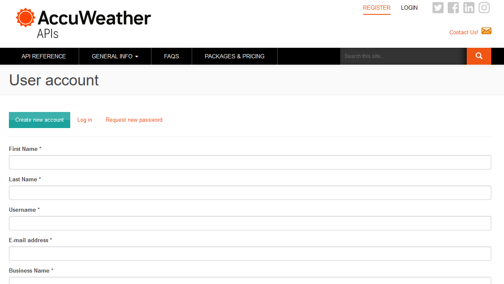
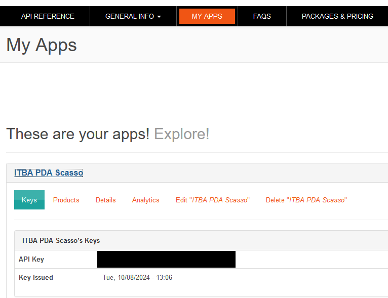
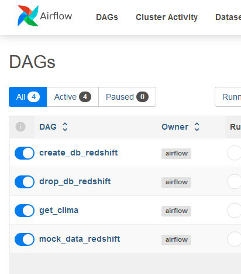
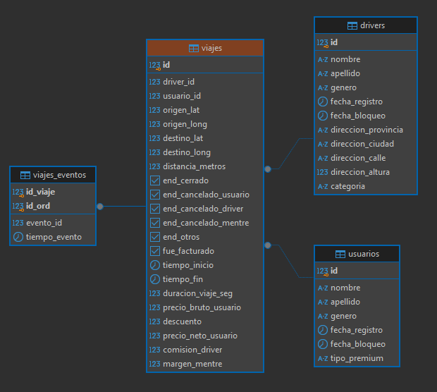
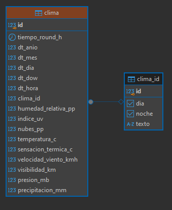
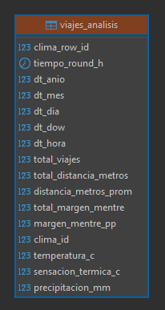

# Python Data Applications

</img>

Alumno: Scasso, Facundo M.

Repositorio del TP para ITBA Python Data Applications.

## Temática seleccionada

Tenemos un negocio de *ridesharing* llamado **Mentre** que opera en CABA, Argentina.
Nuestra base de datos se encuentra en Redshift, y queremos desarrollar un ETL basado en Airflow.

</img>

## Utilización del código

Empezaremos por la utilización de código por un tema de eficiencia, pero más abajo en la sección **Composición del repositorio** ahondaremos más en los archivos del proyecto.

### Seteos adicionales para la exploración de código

Para la exploración de código y un correcto linting en VSCode, deberá crearse el _virtual environment_ con los siguientes comandos:

```bash
make venv
source .venv/bin/activate  # o activarlo mediante el pop-up de VSCode
make install
```

### API key para la API pública

https://developer.accuweather.com/accuweather_custom/package/purchase/free/free

</img>

1. Ingresar los datos que pide AccuWeather.
2. Verificar la casilla de correo haciendo click en el link que llega por email.
3. Hacer login inmediatamente y configurar una contraseña personal para AccuWeather.
4. Crear una app en la sección MY APPS.
5. Una vez creada la app, copiar su API key. AccuWeather permite hasta _50 llamadas diarias_ con el plan gratuito.
6. Poner esta API key en el archivo `.env` como una variable de entorno de nombre **ACWT_API_KEY**.

</img>

### Levantar Airflow

Para levantar Airflow se necesita utilizar Docker. Para Windows es necesario contar con WSL y Docker Desktop abierto y corriendo.

Poner el archivo `.env` -provisto al profesor- en la carpeta `mentre/`. Luego, ubicarse en dicha carpeta y levantar Airflow mediante los siguientes comandos de Docker Compose:
```bash
cd mentre
docker compose up airflow-init
docker compose up
```

### Airflow DAGs

Una vez levantado Airflow, ir a http://localhost:8080/home desde un explorador para acceder, utilizando el usuario y contraseña provisto al profesor.

Se encontrarán con los siguientes DAGs:
- `create_database`: Crea las tablas del proyecto con sus correspondientes esquemas de tipo de datos en el schema `DB_SCHEMA` del archivo `.env`.
- `drop_database`: Elimina completamente las tablas del proyecto.
- `get_clima` (c/hora): Llama a la API de AccuWeather para pedir el detalle meteorológico actual de la Ciudad Autónoma de Buenos Aires (Argentina), lo transforma a tabla, filtra las columnas necesarias y lo sube a Redshift.
- `mock_data_redshift`: Crea de forma aleatoria la información falsa _(mock)_ del proyecto, tomando hipótesis varias para dicha creación, de tal forma que haya correspondencia y cierta correlación entre las variables de las tablas. Este DAG está preparado para detectar 2 situaciones de interés:
    - Si no existe una tabla requerida, levanta un error.
    - Si existe la tabla requerieda pero no está vacía, saltea todos los cálculos del task correspondiente. (Por un problema con el nombre del .)
- `mock_new_viajes`: Reutilización del código de las tasks de `viajes` y `viajes_eventos` para la creación de más viajes.

</img>

El camino usual es:
1. `create_database`
2. `mock_data_redshift`
3. `mock_new_viajes` (pueden ser múltiples veces)

Para el desarrollador: ante cualquier inconveniente que no pueda ser resuelto por debuguear `mock_data_redshift`, usar `drop_database` y volver a correr los DAGs 1 y 2.

## Stack tecnológico

- 🐍 Python
    - airflow
    - pandas (con CSV y Parquet)
    - pytest
    - requests (para la API de AccuWeather)
    - sqlalchemy (para el cluster de RedShift provisto por la universidad)
- 🏭 Amazon Redshift
- 🐋 Docker & Docker Compose
- 🐙 GitHub Actions

## Composición del repositorio

### Base de datos

Utilizamos el clúster de Amazon Redshift proveída por la universidad. En el schema del proyecto encontraremos las siguientes tablas:
- `drivers`: Registro de la información de los _drivers_ o conductores. Cada fila es un conductor distinto.
- `usuarios`: Similar a `drivers` pero cada fila es un usuario de Mentre.
- `viajes`: Almacena la información de los viajes efectuados. Cada fila es un viaje con su propio id, y relaciona un id de driver y un id de usuario en este viaje. La mayoría de la información útil se encuentra en esta tabla.
- `viajes_eventos`: Se encarga de registrar los llamados "eventos" del viaje en cuestión. Un viaje puede tener uno de los `evento_id` catalogados, y este evento puede ser "reemplazado" con un evento de `tiempo_evento` posterior, aunque el historial completo es útil en términos de auditoría y mejora continua. El camino usual es empezar en **0** y terminar en **1**, siendo cualquier otro contratiempo catalogado por el resto de los `evento_id`. Del mismo modo, si un viaje fue corregido posteriormente, su `evento_id` finalmente será **1**.
    - **0**: abierto
    - **1**: end_cerrado
    - **2**: end_cancelado_usuario
    - **3**: end_cancelado_driver
    - **4**: end_cancelado_mentre
    - **999**: end_otros

</img>

Para las tablas de clima en CABA hemos propuesto la siguiente estructura:
- `clima_id`: Almacena los posibles valores de la API de AccuWeather en cuanto al tipo cualitativo de clima. La totalidad de estos valores puede encontrarse en el archivo `clima_id.csv` de la subcarpeta `tables` (ver siguiente sección).
- `clima`: Registra cada 1 hora el clima en CABA según los datos de la API de AccuWeather. No sólo guardamos la `temperatura_c` _(temperatura en Celsius)_, sino otros factores que nos pueden ser de interés analítico como la `humedad_relativa_pp` _(humedad relativa en puntos porcentuales 0-100)_, la `precipitacion_mm`, el `indice_uv`, etc.

</img>

Adicionalmente, hay una tabla analítica que une a estos 2 DER:
- `viajes_analisis`: Representa una tabla resultado de una query analítica, como una que se usaría en la práctica para tratar de relacionar -en este caso- el clima de la hora correspondiente con varios indicadores operativos y de negocio. Relaciona `viajes` con `clima`.

</img>

### Airflow

Nuestra implementación de Airflow es mediante Docker Compose, habiendo partido del [archivo oficial](https://airflow.apache.org/docs/apache-airflow/stable/howto/docker-compose/index.html) que provee Airflow.

La carpeta principal `mentre/` contiene todos los archivos relevantes a Airflow, véase:
- Las carpetas `config`, `dags`, `logs` y `plugins`
- El archivo `docker-compose.yaml`
- El archivo `Dockerfile` (que es tomado por Docker Compose para levantar la imagen de Mentre)
- Los archivos de requerimientos para Python `requirements_test.txt` y `requirements.txt`

La totalidad del código de Airflow se encuentra en la carpeta `dags`. Los DAGs están sueltos en dicha carpeta, y contamos con varias carpetas más:
- `tasks`: Contiene algunas de las funciones utilizadas en los tasks para los DAGs.
- `code`: El resto de código Python, separado por competencias.
- `options`: Archivos útiles para el correcto uso de valores del proyecto, por ejemplo, strings conocidos. Reduce typos al escribir y referenciar código.
- `tables`: Información estática del proyecto, donde residen las tablas que no dependen de la aleatoriedad.
- `mock`: Archivos útiles para la creación aleatoria de datos falsos _(mock)_.
- `queries`: Queries para su utilización en el código mediante sqlalchemy. Se fuerza su utilización mediante funciones centralizadas, con el objetivo de estandarizar las llamadas a la base de datos. Caso contrario, podrían generarse errores que afectarían la base de forma permanente, o incluso abrir la puerta a casos maliciosos como lo puede ser la inyección de código SQL.
- `local`: Donde residen los archivos de forma local que generan las tasks de nuestros DAGs de Airflow. Se utiliza para levantar resultados intermedios en tasks posteriores, pasando únicamente los caminos _(paths)_ de los archivos y no el objeto en sí.

### Tests

La carpeta `tests` contiene los tests del proyecto. Adicionalmente, tiene un archivo especial llamado `conftest.py` que lo utilizamos para que los imports relativos del proyecto se comporten de manera equivalente a como lo hacen en Airflow, para que no se genere un error al correr los tests.

Para correr los tests puede utilizarse el siguiente comando:
```bash
make test
```

No obstante, en el siguiente ítem veremos su utilización automática, sin necesidad de correr el comando de forma manual.

### GitHub Actions

El proyecto cuenta con 2 workflows para GitHub Actions, localizados en la carpeta `.github/workflows/`.

#### `test.yaml`

Setea todo lo necesario en un Ubuntu con Python 3.10, y prueba correr tanto ruff (linting) como pytest (testing). El build en sí y estos 2 checks deben correrse exitosamente para considerar la corrida del workflow como exitosa.

El check se hace tanto en PR a develop y main, como cuando ya está hecho el merge (que cuenta como un push). Esto representa un flujo normal en el ámbito laboral, ya que se suele "duplicar" este check antes y después de mergear para minimizar la cantidad de errores y estar seguros de que el código que llega a develop y a main cumple nuestros estándares de calidad.

#### `enforcer.yaml`

Este workflow adicional sólo corre cuando se hace un PR a main. Genera un status check que falla si se intenta hacer un PR desde una branch que no sea develop.

## Recursos utilizados

- [Running Airflow in Docker](https://airflow.apache.org/docs/apache-airflow/stable/howto/docker-compose/index.html)
- [Starter Workflows](https://github.com/actions/starter-workflows)
- [Spanish Names](https://github.com/marcboquet/spanish-names)

## Licencia

Todo el código desarrollado se encuentra bajo la licencia **GPL-3.0**. Pueden encontrar su contenido en el archivo `LICENSE`, pero recomendamos leer el resumen de la misma [aquí](https://choosealicense.com/licenses/gpl-3.0/).

Disclaimers: Este es un proyecto personal, para el curso de ITBA Python Data Applications y en categoría de alumno. El logo de Mentre es un logo ficticio hecho mediante Microsoft Copilot.
